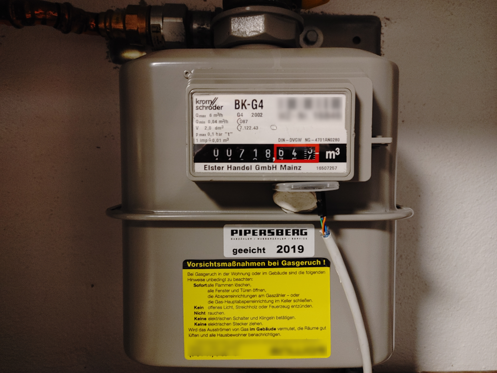
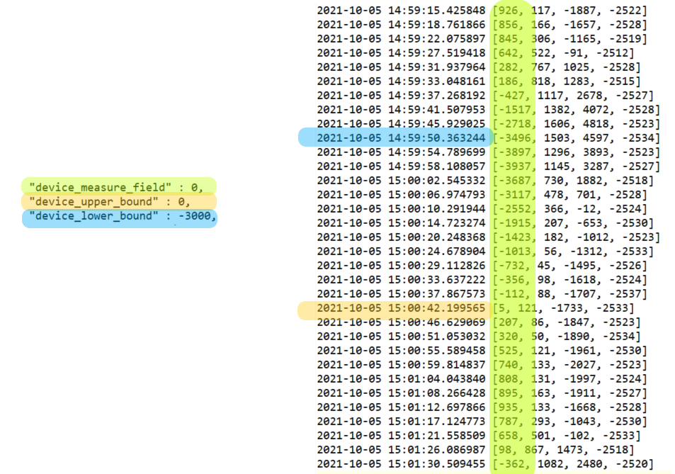
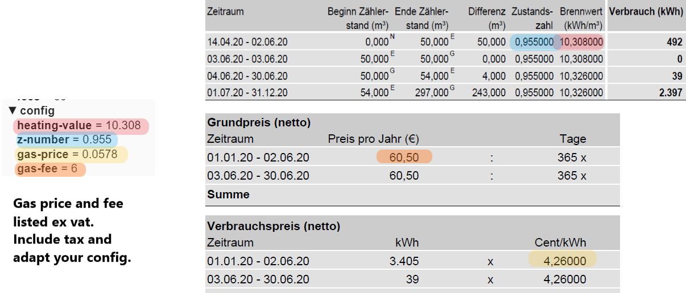
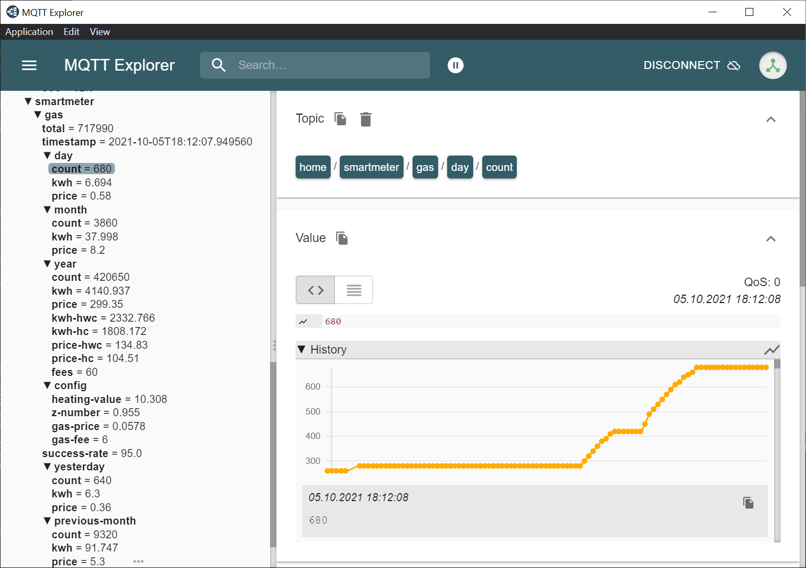
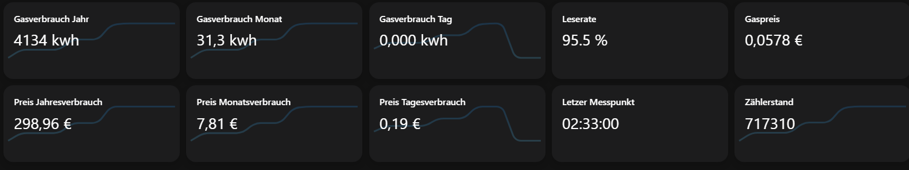

# Smartmeter Gas

If you have an *old-style* gasmeter to measure gas consumption it's still possible to turn it into a smart device.



## Pre-conditions

* basic solder skills
* Raspberry Pi with free connectors
* MQTT Server

## Hardware

The software works on the hardware of the [magnetic sensor QMC5883L](https://www.google.com/search?q=QMC5883L&rlz=1C1ONGR_deDE951DE951&oq=QMC5883L). Find [assembly instructions in german](https://tutorials-raspberrypi.de/raspberry-pi-kompass-selber-bauen-hmc5883l/) or [here in english version](https://www.electronicwings.com/raspberry-pi/triple-axis-magnetometer-hmc5883l-interfacing-with-raspberry-pi).

**Note:** The above Tutorials are referencing the HMC5883L hardware from Honeywell while this software takes care for QMC5883L - the chinese version of the chip. For hardware assembly this makes no difference but software will differ!

Before running this Software you need to check hardware is basically working:

```
[03:13:20] openhabian@openhab:~$ i2cdetect -y 1
     0  1  2  3  4  5  6  7  8  9  a  b  c  d  e  f
00:          -- -- -- -- -- -- -- -- -- -- 0d -- --
10: -- -- -- -- -- -- -- -- -- -- -- -- -- -- -- --
20: -- -- -- -- -- -- -- -- -- -- -- -- -- -- -- --
30: -- -- -- -- -- -- -- -- -- -- -- -- -- -- -- --
40: -- -- -- -- -- -- -- -- -- -- -- -- -- -- -- --
50: -- -- -- -- -- -- -- -- -- -- -- -- -- -- -- --
60: -- -- -- -- -- -- -- -- -- -- -- -- -- -- -- --
70: -- -- -- -- -- -- -- --

```

## Software

The software is written in python3. If 
```
python3 --version
```
returns a valid result you're fine. Otherwise [follow the install instructions](https://docs.python-guide.org/starting/install3/linux/)

Now switch to your desired directory and clone the repo 
```
git clone https://github.com/weymann/smartmeter-gas.git
```

### Dependencies

Install the needed python modules to enable hardware access plus distributing data via MQTT

* [QMC5883L python driver](https://github.com/RigacciOrg/py-qmc5883l)
* [Paho MQTT](https://www.eclipse.org/paho/index.php?page=clients/python/index.php) for data distribution 

Check if dependencies are solved with a quick call

```
smartmeter_gas.py help
```


### Configuration

Configuration is stored in ```config.json```  in the same directoy as the python script. Basically three sections needs to be configured:
* hardware configuration of values which shall trigger a count
* MQTT configuration to distribute data
* some technical data from your gas bill to calculate kwh consumption and pricing 
```
{
    "device_measure_field" : 0,
    "device_upper_bound" : 0,
    "device_lower_bound" : -3000,
    "mqtt_server" : "whereever.youwant.com",
    "mqtt_port" : 8883,
    "mqtt_user" : "user",
    "mqtt_pwd" : "password",
    "mqtt_topic" : "home/smartmeter/gas",
    "cert_location" : "/etc/ssl/certs/ca-certificates.crt",
    "z_number" : 0.955,
    "heating_value" : 10.308,
    "gas_price" : 0.0578,
    "gas_fee_month" : 6
}
```

#### Device

Figure out your device settings running the script with parameter *setup*

```
smartmeter_gas.py setup
```

Each second a log output is given with the current measured values. Find a time slot when gas is consumed. The example in the picture below is showing the changes during consumption - values are going down from approx *1000* to *-4000* and up again. Record such a cycle and derive your config
* ```device_measure_field``` - column of the desired measurement (green)
* ```device_upper_bound``` - value to enter state *count* (blue)
* ```device_lower_bound``` - value to exit state *count* (orange)



#### Kwh / Price

In order to calculate kwh consumption and a corresponding price take your latest bill. You should find the *z-number* and *heating value* somewhere. If this isn't declared leave it to the already defined values in config json. It's a fair assumption: 1 m<sup>3</sup> ~ 10 kwh.

Pricing should be found in your bill. Prices in the below german example are ex vat so you need add the tax rate in order to get the paying price.



#### MQTT

You should be aware of your mqtt settings. 
If not encrypted change the ```mqtt_port``` to 1883 and leave the ```cert_location``` empty. 
If even anonymous is allowed leave ```mqtt_user``` and ```mqtt_pwd``` empty.

### Check Data

I use [MQTT Explorer](http://mqtt-explorer.com/) to check my IoT devices. You'll see the current values in the left tree and on the right side history for the selected topic is found.



### Data / Config Changes 

The kwh and price values of the configuration can be changed with a simple *publish* call e.g. using the [MQTT Explorer](http://mqtt-explorer.com/). So if you receive a new bill adapt the new values and publish them - no software restart necessary.

It's also possible due to some miscounting or device errors the reported total counter and the *real* measured counter diverges. From time to time check the counter manually. If the number from this smartmeter doesn't match simply publish the correct counter value - no software restart necessary.

# Going further

Great! You turned an old fashioned gas meter which needs to be checked manually into a full fashioned auto reporting smart meter. 

Use now your data and put it into your favorite Smarthome Software. I use [openHAB](https://www.openhab.org/) which provides the capability to receive MQTT data.


